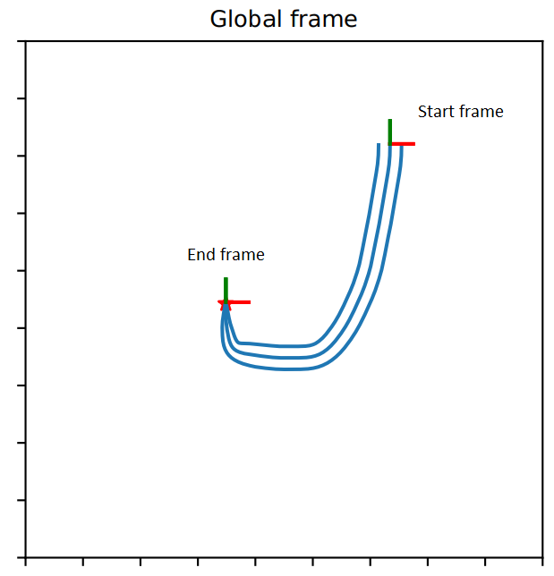

# tp-rmp
This repos implements the method for "Learning Task-parametrized Riemannian Motion Policies" from demonstrations.

## Installation

The installation is simple, please choose your directory that you want to save `tp-rmp` repo and change to that directory. Then type:

```bash
git clone https://github.com/humans-to-robots-motion/tp-rmp
cd tp-rmp
pip install -r requirements.txt
```

## Usage

We create a dataset of 2D skills consisting of `start` frame and `end` frame

For 2D virtual point system setting, to see the reproduction the following 2D skill:



under moving `end` frame in circle, please run:

```bash
python scripts/test_tprmp_2d_moving.py
```

to see the reproduction under moving `end` frame in circle and avoiding obstacle, please run:

```bash
python scripts/test_tprmp_2d_moving_rmpflow.py
```

For 6-DoFs UR5 robot arm setting, to see the reproduction of picking skill under dynamic task situations, e.g. pick moving object, please run:

```bash
python scripts/test_tprmp_moving.py
```

For additionally avoiding obstables, please run:

```bash
python scripts/test_tprmp_with_rmpflow_moving.py
```